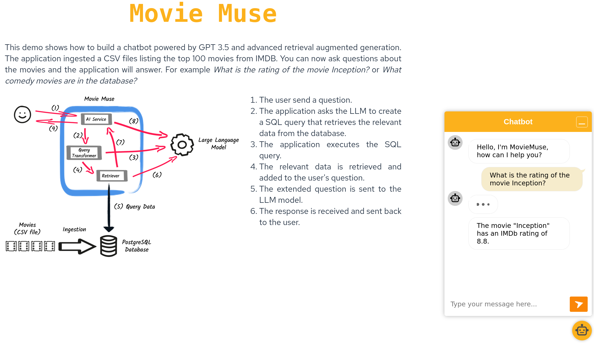

# Sample chatbot using advanced RAG and a SQL database

Set your OpenAI API key into the `QUARKUS_LANGCHAIN4J_OPENAI_API_KEY`
environment variable. Then, run the example by executing `mvn quarkus:dev`
and open `localhost:8080` in your browser and start chatting.

The chatbot uses a SQL database with information about movies with their
basic metadata (the database is populated with data from
`src/main/resources/data/movies.csv` at startup). When you ask a question, an
LLM is used to generate SQL queries necessary for answering your question.
Check the application's log, the SQL queries and the retrieved data will be
printed there.

