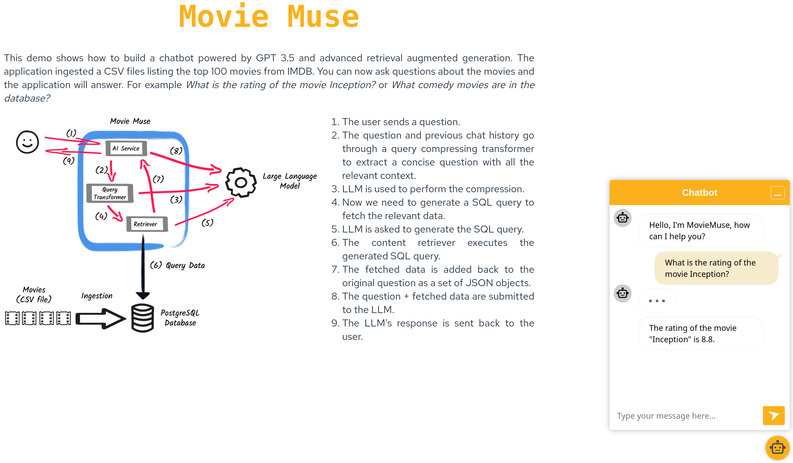

# Sample chatbot using advanced RAG and a SQL database



This example demonstrates how to create a chatbot with RAG using
`quarkus-langchain4j`. This chatbot internally uses LLM-generated SQL
queries to retrieve the relevant information from a PostgreSQL database.

## Running the example

A prerequisite to running this example is to provide your OpenAI API key.

```
export QUARKUS_LANGCHAIN4J_OPENAI_API_KEY=<your-openai-api-key>
```

Then, simply run the project in Dev mode:

```
mvn quarkus:dev
```

## Using the example

Open your browser and navigate to http://localhost:8080. Click the orange robot
in the bottom right corner to open the chat window.

The chatbot uses a SQL database with information about movies with their
basic metadata (the database is populated with data from
`src/main/resources/data/movies.csv` at startup). When you ask a question, an
LLM is used to generate SQL queries necessary for answering your question.
Check the application's log, the SQL queries and the retrieved data will be
printed there.

